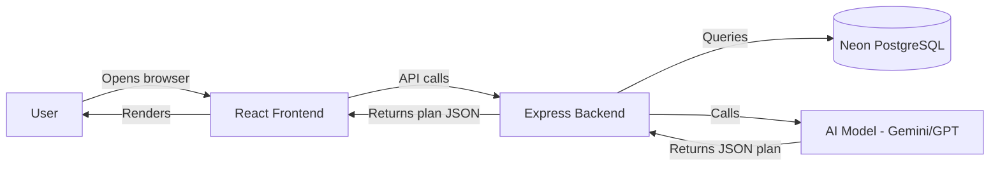
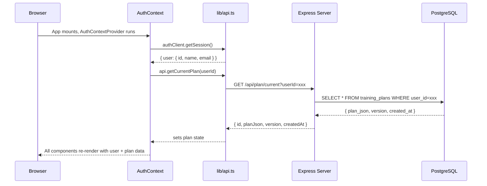

# FormaAI — Complete Project Documentation

> Written for a junior React developer who has never seen this codebase. Every concept is explained from first principles.

---

## Table of Contents

1. [Project Overview](#1-project-overview)
2. [Data Flow](#2-data-flow)
3. [JSON Structure](#3-json-structure)
4. [Pages](#4-pages)
5. [Components](#5-components)
6. [React Concepts Used](#6-react-concepts-used)
7. [State Management](#7-state-management)
8. [Functions](#8-functions)
9. [API Integration](#9-api-integration)
10. [UI States](#10-ui-states)
11. [Routing](#11-routing)
12. [Styling](#12-styling)
13. [Project Flow — Full Walkthrough](#13-project-flow--full-walkthrough)
14. [Future Improvements](#14-future-improvements)

---

## 1. Project Overview

### What is FormaAI?

FormaAI is a **full-stack AI-powered gym planning application**. A user signs up, answers questions about their fitness goals (age, weight, split preference, etc.), and the backend sends those answers to an AI model (e.g. Gemini or GPT). The AI generates a detailed, personalized weekly workout plan. The app then displays that plan as a beautiful, interactive fitness dashboard.

### Architecture

The project is split into two parts:

```
AI-GYM-PLANNER (working)/
├── client/     ← React + TypeScript + Tailwind CSS frontend
└── server/     ← Express + TypeScript + Prisma backend
```



The **frontend** never talks to the AI directly. It only talks to the backend Express server. The backend handles the AI generation, stores the result in PostgreSQL, and returns it to the frontend.

### Folder Structure (Client)

```
client/src/
├── App.tsx              ← Root component, sets up all routes
├── main.tsx             ← Entry point, wraps everything in providers
├── index.css            ← Global CSS, Tailwind imports, theme variables
│
├── types/
│   └── index.ts         ← TypeScript type definitions (the shape of all data)
│
├── lib/
│   ├── api.ts           ← All HTTP calls to the backend (one place, easy to change)
│   ├── auth.ts          ← Neon auth client setup
│   └── utils.ts         ← Utility helpers (cn() for class merging)
│
├── context/
│   └── AuthContext.tsx  ← Global state: logged-in user + current plan
│
├── pages/
│   ├── Home.tsx         ← /home — dashboard
│   ├── Profile.tsx      ← /profile — user profile + plan overview
│   ├── Schedule.tsx     ← /schedule — weekly calendar + exercises
│   ├── WorkoutPage.tsx  ← /workout/:day — active workout session
│   ├── Progress.tsx     ← /progress — history + streak
│   ├── Plans.tsx        ← /plans — list of AI-generated plans
│   ├── Settings.tsx     ← /settings — user preferences
│   ├── Auth.tsx         ← /auth/* — login/signup
│   └── Onboarding.tsx   ← /onboarding — setup wizard
│
└── components/
    ├── layout/
    │   └── Navbar.tsx       ← Top navigation + mobile bottom bar
    └── ui/
        ├── Button.tsx            ← Reusable button
        ├── Input.tsx             ← Styled text input
        ├── OptionCard.tsx        ← Selectable card (used in onboarding)
        ├── ProgressBar.tsx       ← Animated progress bar
        ├── StatsCard.tsx         ← Single-stat display card
        ├── LoadingSkeleton.tsx   ← Animated placeholder loaders
        ├── ConfirmationModal.tsx ← "Are you sure?" dialog
        ├── PlanOverviewCard.tsx  ← Displays the AI plan summary
        ├── ExerciseCard.tsx      ← Single exercise with all details
        ├── WorkoutCard.tsx       ← Day workout preview card
        ├── WeeklyCalendar.tsx    ← Mon–Sun calendar widget
        └── RestTimer.tsx         ← Countdown timer between sets
```

**Why this structure?** Each folder has a single responsibility:
- `pages/` = one file per URL route
- `components/ui/` = reusable building blocks used across multiple pages
- `lib/` = all external communication (API, auth) in one place so it's easy to swap
- `context/` = global data that any component can access without prop-drilling
- `types/` = all TypeScript shapes defined once, used everywhere

---

## 2. Data Flow

### How data travels from backend to UI



### The complete lifecycle of a plan

1. **Created**: User completes onboarding → backend calls AI → AI returns JSON → saved to DB
2. **Fetched**: App loads → `AuthContext` calls `api.getCurrentPlan()` → stores in React state
3. **Displayed**: All pages read from `useAuth().plan` → no second fetch needed
4. **Updated**: User clicks "Regenerate" → `generatePlan()` → new plan saved → `refreshData()` re-fetches → state updates → all pages re-render automatically
5. **Workout data**: Stored in `localStorage` (no backend endpoint yet) — history, streak, weekly progress

### Where data lives

| Data | Where it lives | Why |
|------|----------------|-----|
| Logged-in user | `AuthContext` state | Needed by every page |
| Current AI plan | `AuthContext` state | Needed by every page |
| Workout history | `localStorage` | No backend endpoint yet; persists between sessions |
| Streak count | `localStorage` | Same reason |
| User settings (units, reminders) | `localStorage` | Client-only preferences |
| Past plans list | Backend `/api/plan/all` | Needs to be persistent + server-authoritative |

---

## 3. JSON Structure

### What the backend returns from `GET /api/plan/current`

```json
{
  "id": "fe4a734c-98e1-450c-bf01-4df986bf500b",
  "userId": "6be7bf6f-c096-4227-8a21-5af1682274f9",
  "planJson": {
    "overview": {
      "goal": "Build muscle mass through progressive overload with a focus on compound movements",
      "frequency": "3 days per week",
      "split": "Upper_Lower",
      "notes": "Prioritize time under tension and proper form. Adjust weights based on RPE. Allow 48-hour recovery between upper/lower sessions."
    },
    "weeklySchedule": [
      {
        "day": "Monday",
        "focus": "Upper Body",
        "exercises": [
          {
            "name": "Barbell Bench Press",
            "sets": 4,
            "reps": "6-8",
            "rest": "2-3 min",
            "rpe": 8,
            "notes": "Keep bar path tight. Squeeze glutes to stabilize core.",
            "alternatives": ["Dumbbell Bench Press", "Landmine Press"]
          }
        ]
      }
    ],
    "progression": "Increase weight by 5-10% every 2 weeks when all sets reach target reps."
  },
  "planText": "...",
  "version": 1,
  "createdAt": "2026-07-21T14:09:14.778Z"
}
```

### Field-by-field explanation

#### Top level

| Field | Type | Meaning | Used in UI |
|-------|------|---------|------------|
| `id` | string (UUID) | Unique ID for this plan in the database | Plans page delete/restore |
| `userId` | string (UUID) | ID of the user who owns this plan | API calls |
| `planJson` | object | The AI-generated plan data (see below) | Everything |
| `planText` | string | Raw JSON as a string (stored for reference) | Not displayed |
| `version` | number | Increments each time a new plan is generated | Profile badge, Plans page |
| `createdAt` | string (ISO date) | When this plan was created | Profile page, Plans page |

#### `planJson.overview`

| Field | Type | Meaning | Used in UI |
|-------|------|---------|------------|
| `goal` | string | The user's primary fitness objective | PlanOverviewCard, Profile header badge |
| `frequency` | string | How many days per week | PlanOverviewCard, Schedule subtitle |
| `split` | string | Training split style (e.g. `Upper_Lower`) | Profile badge (underscores replaced with ` / `) |
| `notes` | string | General coaching notes for the plan | PlanOverviewCard |

#### `planJson.weeklySchedule[]`

Each element represents one training day:

| Field | Type | Meaning | Used in UI |
|-------|------|---------|------------|
| `day` | string | Day name e.g. `"Monday"` | Calendar, WorkoutCard, WorkoutPage title |
| `focus` | string | What muscle group e.g. `"Upper Body"` | WorkoutCard, Schedule badge |
| `exercises` | array | List of exercises for the day | ExerciseCard list |

#### `planJson.weeklySchedule[].exercises[]`

Each exercise object:

| Field | Type | Meaning | Used in UI |
|-------|------|---------|------------|
| `name` | string | Exercise name | ExerciseCard title, checkbox key |
| `sets` | number | How many sets to perform | ExerciseCard stat, WorkoutCard total sets |
| `reps` | string | Rep range e.g. `"6-8"` | ExerciseCard stat |
| `rest` | string | Rest time e.g. `"2-3 min"` | ExerciseCard stat, RestTimer default seconds |
| `rpe` | number | Rate of Perceived Exertion (1-10 scale) | ExerciseCard RPE bar + badge, avg calculation |
| `notes` | string? | Coaching cue | ExerciseCard bottom note |
| `alternatives` | string[]? | Substitute exercises | ExerciseCard collapsible section |

#### `planJson.progression`

A plain string describing how to progress over time. Displayed as a row in `PlanOverviewCard`.

---

## 4. Pages

### `/home` — Home.tsx

**Purpose**: The main dashboard. The first thing a logged-in user sees after onboarding. Shows a summary of everything at a glance.

**Components used**: `WorkoutCard`, `StatsCard`, `CardSkeleton`, `StatSkeleton`

#### State variables

| Variable | Type | Initial value | Purpose |
|----------|------|---------------|---------|
| `user` | User\|null | from context | Check if logged in |
| `loading` | boolean | from context | Show skeletons while fetching |
| `plan` | TrainingPlan\|null | from context | Source of all workout data |

> Note: Home has **no local state** — all state comes from `useAuth()`. This is deliberate: the plan is global data that multiple pages share.

#### Helper functions (defined outside component)

**`getTodayName()`**
- Gets the JavaScript `Date.getDay()` which returns 0-6 (Sunday=0)
- Maps it to a full day name string like `"Monday"`
- Used to find which workout schedule matches today

**`getStreakCount()`**
- Reads `localStorage.getItem("workoutStreak")`
- Parses the JSON, returns the `count` number
- Returns 0 if not found or corrupt

**`getWeeklyProgress(workoutDays)`**
- Reads `localStorage.getItem("weeklyWorkouts")` — an array of ISO date strings
- Filters for dates within the last 7 days
- Divides by `workoutDays.length` (the plan's workout days count) and multiplies by 100
- Returns a 0-100 percentage

#### Computed values (inside component, using `useMemo`)

**`todaySchedule`**
```typescript
const todaySchedule = useMemo(() =>
    plan?.weeklySchedule.find(s => s.day.toLowerCase() === today.toLowerCase()),
    [plan, today]
);
```
- Searches the plan's `weeklySchedule` array for a day matching today
- `useMemo` means it only recalculates if `plan` or `today` changes (not on every render)
- Result: `DaySchedule | undefined`

**`nextSchedule`**
- Loops through the 7 days starting from tomorrow, finds the first one that has a workout
- Uses modulo `% 7` to wrap around from Sunday back to Monday

#### Rendering logic (conditional rendering)

```
if loading         → show StatSkeleton x4 + CardSkeleton x2
if !user && done   → redirect to /auth/sign-in
if user && no onboarding → redirect to /onboarding
if plan exists     → show full dashboard
if !plan           → show "No Plan Yet" call-to-action card
```

#### User interactions

- Clicking **WorkoutCard** for today → navigates to `/workout/monday` (dynamic)
- Clicking **"Start Workout"** quick action → same
- Clicking **"Schedule"** → `/schedule`
- Clicking **"Profile"** → `/profile`

---

### `/profile` — Profile.tsx

**Purpose**: Shows the user's identity, their AI plan's key details, computed stats about the plan, and lets them regenerate a new plan.

**Components used**: `PlanOverviewCard`, `StatsCard`, `ConfirmationModal`, `CardSkeleton`, `StatSkeleton`

#### State variables

| Variable | Type | Initial value | Purpose |
|----------|------|---------------|---------|
| `modalOpen` | boolean | `false` | Controls whether the confirmation dialog is visible |
| `regenStatus` | `"idle"\|"loading"\|"success"\|"error"` | `"idle"` | Drives what the Regenerate button looks like and which banner to show |
| `regenError` | string | `""` | Error message text when regeneration fails |

#### Computed values

These are calculated **inline** (not memoized, as they're lightweight):

- `workoutDays` = `plan.weeklySchedule.length`
- `totalExercises` = sum of exercises across all days
- `allRpes` = flat array of all RPE values across all exercises
- `avgRpe` = `sum(allRpes) / allRpes.length`, formatted to 1 decimal
- `weeklySets` = sum of all `sets` across all exercises on all days
- `initials` = first letter of each word in user's name, max 2 characters

#### `handleRegenerate()` — the most important function

```typescript
const handleRegenerate = async () => {
    setModalOpen(false);       // Close the dialog
    setRegenStatus("loading"); // Show spinner on button
    setRegenError("");         // Clear old errors
    try {
        await generatePlan();  // POST /api/plan/generate — AI creates a new plan
        await refreshData();   // GET /api/plan/current — fetch the new plan into state
        setRegenStatus("success");              // Show green banner
        setTimeout(() => setRegenStatus("idle"), 3000); // Clear after 3s
    } catch (err) {
        setRegenError(err.message);
        setRegenStatus("error");
        setTimeout(() => setRegenStatus("idle"), 4000);
    }
};
```

**Step by step**:
1. Close the confirmation dialog immediately
2. Set status to `"loading"` — button becomes disabled and shows spinner
3. Call `generatePlan()` from context — this posts to `/api/plan/generate`
4. The backend AI generates a new plan and saves it to the database
5. Call `refreshData()` — this re-fetches from `/api/plan/current`
6. The new plan data flows back through context into every page
7. Status becomes `"success"` → green banner appears
8. After 3 seconds, everything resets to `"idle"`

#### Rendering logic

```
if !user && !loading → redirect to /auth/sign-in
if !onboardingCompleted && !loading → redirect to /onboarding
regenStatus === "success" → show green banner
regenStatus === "error" → show red banner with error message
regenStatus === "loading" → button shows spinner + "Generating..."
loading → StatSkeleton x4 + CardSkeleton for plan overview
plan exists → PlanOverviewCard + 4 StatsCards
!plan → empty state with message
ConfirmationModal is always rendered, just hidden when isOpen=false
```

---

### `/schedule` — Schedule.tsx

**Purpose**: Shows the full weekly training schedule. User can click any workout day to see all exercises for that day.

**Components used**: `WeeklyCalendar`, `ExerciseCard`

#### State variables

| Variable | Type | Initial value | Purpose |
|----------|------|---------------|---------|
| `selectedDay` | `string\|null` | `null` | Which day the user clicked on |

#### Computed values (with `useMemo`)

**`selectedSchedule`**
```typescript
const selectedSchedule = useMemo(() =>
    selectedDay
        ? plan?.weeklySchedule.find(s => s.day.toLowerCase() === selectedDay.toLowerCase())
        : null,
    [selectedDay, plan]
);
```
When `selectedDay` changes, this automatically finds the matching day from the plan.

**Derived stats** (calculated from `selectedSchedule`):
- `totalSets` — sum of sets across all exercises in the selected day
- `avgRpe` — average RPE formatted to 1 decimal
- `estimatedTime` — calculated by assuming each set takes 2.5 minutes + rest time between sets

#### How clicking a day works

```typescript
onSelectDay={(day) => setSelectedDay(prev => 
    prev?.toLowerCase() === day.toLowerCase() ? null : day
)}
```
This is a **toggle**: clicking the same day twice deselects it (sets to `null`). Clicking a different day selects it.

#### Rendering logic

```
WeeklyCalendar always renders (shows which days are workout days)
selectedSchedule exists → show exercise list + workout summary card
!selectedSchedule && plan exists → show prompt ("select a day")
!plan → empty state
```

---

### `/workout/:day` — WorkoutPage.tsx

**Purpose**: The active workout session page. User checks off exercises as they complete them, uses the rest timer, and finishes the workout.

**Components used**: `ExerciseCard`, `ProgressBar`, `RestTimer`

#### State variables

| Variable | Type | Initial value | Purpose |
|----------|------|---------------|---------|
| `checked` | `Set<string>` | `new Set()` | Set of exercise names that have been checked off |
| `timerOpen` | boolean | `false` | Whether the RestTimer modal is visible |
| `timerSeconds` | number | `120` | How many seconds the rest timer is set to |
| `finished` | boolean | `false` | Whether the workout has been completed |
| `startTime` | number | `Date.now()` | Timestamp when the component first mounted (never changes) |

> **Why `Set<string>` for `checked`?** A `Set` makes it O(1) to check if an exercise is completed (`checked.has(name)`). A regular array would require scanning every element.

#### Route parameter

```typescript
const { day } = useParams<{ day: string }>();
```
`useParams` reads from the URL. If the URL is `/workout/monday`, then `day = "monday"`.

#### `handleCheck(name, isChecked)` — the core interaction

```typescript
const handleCheck = (name: string, isChecked: boolean) => {
    setChecked(prev => {
        const next = new Set(prev); // 1. Copy the existing Set
        if (isChecked) {
            next.add(name);          // 2. Add exercise name
            // 3. Find its rest time from the plan
            const exercise = schedule?.exercises.find(e => e.name === name);
            if (exercise) {
                const restStr = exercise.rest; // e.g. "2-3 min"
                const match = restStr.match(/(\d+(?:\.\d+)?)/); // extract first number
                if (match) {
                    const mins = parseFloat(match[1]); // "2-3 min" → 2.0
                    setTimerSeconds(Math.round(mins * 60)); // 2 minutes = 120 seconds
                    setTimerOpen(true); // auto-open the timer
                }
            }
        } else {
            next.delete(name); // 4. Uncheck
        }
        return next;
    });
};
```

When you **check** an exercise:
1. The exercise name is added to the Set
2. The exercise's `rest` string is parsed to extract the time in minutes
3. The RestTimer opens automatically with the correct duration

#### `handleFinish()` — saving the workout

Calls `saveWorkoutToHistory()` which writes to **three** localStorage keys:

| Key | What it stores |
|-----|----------------|
| `workoutHistory` | Array of session objects (day, focus, completed count, duration) |
| `weeklyWorkouts` | Array of ISO date strings for workouts done |
| `workoutStreak` | `{ count: number, lastDate: string }` |

**Streak logic**:
- If last workout was **today** → already counted, no change
- If last workout was **yesterday** → increment streak
- Otherwise → reset streak to 1

Then sets `finished = true`, which causes React to render the **completion screen** instead of the workout.

#### Progress calculation

```typescript
const progress = schedule
    ? (checked.size / schedule.exercises.length) * 100
    : 0;
```
A simple percentage: how many exercises are checked vs. total.

#### Rendering states

```
loading → pulse skeletons
!schedule (invalid day or rest day) → error card + "View Schedule" button
finished === true → Trophy completion screen
Otherwise → full workout UI
```

---

### `/progress` — Progress.tsx

**Purpose**: Shows the user's workout history, streak, weekly consistency heatmap, and analytics placeholders.

**Components used**: `ProgressBar`, `StatsCard`

#### State variables

| Variable | Type | Initial value | Purpose |
|----------|------|---------------|---------|
| `sessions` | `Session[]` | `[]` | All past workout sessions from localStorage |
| `streak` | `{ count, lastDate }` | `{ 0, "" }` | Current streak data from localStorage |

#### `useEffect` — loading localStorage data

```typescript
useEffect(() => {
    setSessions(getHistory());   // reads localStorage.workoutHistory
    setStreak(getStreak());      // reads localStorage.workoutStreak
}, []); // empty dependency array = runs once when component mounts
```

Empty `[]` means this runs **once** when the page loads — not on every render.

#### 7-day heatmap

```typescript
function getWeekDays(): string[] {
    const days = [];
    for (let i = 6; i >= 0; i--) {  // start 6 days ago, go to today
        const d = new Date();
        d.setDate(d.getDate() - i);
        days.push(d.toDateString()); // e.g. "Tue Jul 22 2026"
    }
    return days;
}
```
For each of the 7 days, it checks if any session in history has a `completedAt` date matching that day string. If yes → red square (workout done). If no → gray square (missed/rest).

---

### `/plans` — Plans.tsx

**Purpose**: Lists all AI-generated plans (or just the current one if backend `/all` endpoint isn't implemented). User can view, restore, or delete plans.

**Components used**: `ExerciseCard`, `ConfirmationModal`, `CardSkeleton`

#### State variables

| Variable | Type | Initial value | Purpose |
|----------|------|---------------|---------|
| `plans` | `PlanListItem[]` | `[]` | Plans fetched from backend |
| `fetchLoading` | boolean | `true` | Loading state for the plans list itself |
| `expandedPlanId` | `string\|null` | `null` | Which plan's exercises are expanded |
| `deleteTarget` | `string\|null` | `null` | ID of plan being deleted (opens modal) |
| `restoreTarget` | `string\|null` | `null` | ID of plan being restored (opens modal) |
| `actionLoading` | boolean | `false` | Loading state during delete/restore |

#### Graceful fallback

```typescript
const displayPlans: PlanListItem[] = plans.length > 0 ? plans : plan ? [
    { id: plan.id, ..., version: plan.version, createdAt: plan.createdAt }
] : [];
```
If the backend `/api/plan/all` doesn't exist yet (returns empty `[]`), we still show the current plan. This prevents the page from looking broken.

---

### `/settings` — Settings.tsx

**Purpose**: User preferences stored in localStorage. Units (kg/lbs), workout reminders, and notes for the next plan regeneration.

**Components used**: custom `ToggleSwitch`, custom `SectionCard` (both defined inside the file)

#### State variables

| Variable | Type | Initial value | Purpose |
|----------|------|---------------|---------|
| `settings` | `UserSettings` | loaded from localStorage | The current settings object |
| `saved` | boolean | `false` | Whether to show the "Settings saved!" banner |

#### `update(key, value)` — generic updater

```typescript
const update = <K extends keyof UserSettings>(key: K, value: UserSettings[K]) => {
    setSettings(prev => ({ ...prev, [key]: value }));
    setSaved(false);
};
```
This is a **generic function** using TypeScript generics. It ensures you can only pass valid setting keys and their matching value types. The spread `{ ...prev, [key]: value }` creates a new object with one field changed.

#### Notification permission handling

```typescript
const handleNotificationToggle = async (val: boolean) => {
    if (val && "Notification" in window) {
        const permission = await Notification.requestPermission();
        if (permission !== "granted") {
            update("remindersEnabled", false); // silently disable if denied
            return;
        }
    }
    update("remindersEnabled", val);
};
```
Before enabling reminders, asks the browser for notification permission. If the user denies it, the toggle is immediately set back to `false`.

---

## 5. Components

### `Navbar.tsx`

**Why it exists**: Persistent navigation at the top of every non-auth page. Provides mobile bottom tab bar.

**Props**: None (reads from `useAuth()` and `useLocation()` internally)

**State**:
- `mobileOpen: boolean` — controls whether the mobile dropdown menu is visible

**Key logic**:
```typescript
const isActive = (to: string) => location.pathname === to;
```
`useLocation()` gives the current URL path. This function returns `true` when the link's path matches, which applies the `nav-active` CSS class (red highlight).

**Mobile bottom bar**: A fixed `<nav>` at the bottom of the screen (visible only on `md:hidden`). Shows 5 of the 6 nav items as icon + label tabs.

---

### `StatsCard.tsx`

**Why it exists**: Consistently styled card showing one metric. Prevents copy-pasting the same card layout across 4+ places.

**Props**:
| Prop | Type | Required | Purpose |
|------|------|----------|---------|
| `label` | string | yes | Small uppercase label above the value |
| `value` | string\|number | yes | The main stat to display |
| `icon` | ReactNode | yes | Icon shown in top-right corner |
| `subtext` | string | no | Small gray text below the value |
| `className` | string | no | Extra CSS classes |
| `accent` | boolean | no | If true, uses red gradient on icon and red text for value |

**No internal state**. Purely presentational (sometimes called a "dumb component").

**Used in**: Home, Profile, Progress

---

### `LoadingSkeleton.tsx`

**Why it exists**: Shows animated placeholder content while data is loading. Much better UX than a blank screen or spinner.

**Exports three things**:
- `StatSkeleton` — placeholder that matches a StatsCard shape
- `CardSkeleton` — placeholder that matches a general card shape
- `ExerciseCardSkeleton` — placeholder for an exercise card
- `default LoadingSkeleton` — flexible, configurable skeleton block

**How it works**: Uses Tailwind's `animate-pulse` class which applies a fade-in/out animation to gray blocks. No JavaScript timers needed — it's pure CSS animation.

**No props required, no internal state.**

---

### `ConfirmationModal.tsx`

**Why it exists**: Any destructive action (delete, regenerate) needs user confirmation. This prevents accidental clicks.

**Props**:
| Prop | Type | Required | Purpose |
|------|------|----------|---------|
| `isOpen` | boolean | yes | Whether the modal is visible |
| `onClose` | function | yes | Called when backdrop or X is clicked |
| `onConfirm` | function | yes | Called when confirm button is clicked |
| `title` | string | yes | Modal heading |
| `description` | string | yes | Explanatory text |
| `confirmLabel` | string | no | Default: "Confirm" |
| `cancelLabel` | string | no | Default: "Cancel" |
| `variant` | `"danger"\|"warning"\|"default"` | no | Icon color |
| `loading` | boolean | no | Shows spinner on confirm button |

**State**: None. All state is owned by the parent.

**Scroll lock**: Uses `useEffect` to add/remove `overflow: hidden` on `document.body` when open. This prevents the page from scrolling behind the modal.

**Click-outside to close**:
```typescript
<div onClick={onClose}>           {/* outer backdrop clicks close */}
    <div onClick={e => e.stopPropagation()}> {/* inner modal does NOT close */}
```
`e.stopPropagation()` prevents the click event from "bubbling up" to the outer div.

**Used in**: Profile (regenerate), Plans (delete, restore)

---

### `PlanOverviewCard.tsx`

**Why it exists**: Displays all overview fields of the AI plan in a consistent, readable format. Used in both Profile and Plans.

**Props**:
| Prop | Type | Purpose |
|------|------|---------|
| `plan` | `TrainingPlan` | The full plan object |

**Internal component**: `InfoRow` — renders a single row with a red icon, label, and value.

**`formatDate(dateStr)`**: Converts ISO date string to `"July 21, 2026"` format using `Intl.DateTimeFormat`.

**No state.**

---

### `ExerciseCard.tsx`

**Why it exists**: The most complex UI component. Shows one exercise with all its details, an RPE visual bar, and collapsible alternatives.

**Props**:
| Prop | Type | Required | Purpose |
|------|------|----------|---------|
| `exercise` | `Exercise` | yes | The exercise data object |
| `index` | number | no | Shows numbered badge (1, 2, 3...) |
| `checked` | boolean | no | Whether this exercise is checked off |
| `onCheck` | function | no | Called when checkbox is clicked |
| `showCheckbox` | boolean | no | Whether to show checkbox mode |

**Internal state**:
- `expanded: boolean` — whether the alternatives section is shown

**RPE color logic**:
```typescript
const rpeColor =
    exercise.rpe >= 8 ? "text-red-400 ..."     // High effort → red
    : exercise.rpe >= 6 ? "text-orange-400 ..."  // Medium → orange
    : "text-green-400 ..."                          // Easy → green
```

**`RpeBar` sub-component**: Renders 10 small dots. The first `rpe` dots are colored (red/orange/green), the rest are gray. This gives a visual "how hard is this?" indicator.

**Used in**: Schedule (view only), WorkoutPage (with checkboxes), Plans (view only)

---

### `WorkoutCard.tsx`

**Why it exists**: Preview card for a workout day — used on Home (today/next) and Schedule. Shows enough info to understand the workout without showing every exercise.

**Props**:
| Prop | Type | Required | Purpose |
|------|------|----------|---------|
| `schedule` | `DaySchedule` | yes | The day's workout data |
| `onClick` | function | no | Navigation handler |
| `variant` | `"default"\|"today"\|"upcoming"` | no | Visual styling |
| `completionPercent` | number | no | Optional progress bar (0-100) |

**Derived values** (computed from `schedule` inside the component, no memoization needed since it's simple):
- `totalSets` — `reduce` to sum all `exercise.sets`
- `avgRpe` — `reduce` to average all `exercise.rpe`

**No state.**

---

### `WeeklyCalendar.tsx`

**Why it exists**: Provides a visual, clickable 7-day calendar widget. Makes it easy to see which days are workout days vs rest days at a glance.

**Props**:
| Prop | Type | Purpose |
|------|------|---------|
| `workoutDays` | `string[]` | Names of workout days, e.g. `["Monday", "Wednesday", "Friday"]` |
| `selectedDay` | `string\|null` | Currently selected day |
| `onSelectDay` | function | Called when a workout day is clicked |
| `schedules` | `DaySchedule[]` | Full schedule data (used to show focus label) |

**`getTodayName()`**: Same utility as in Home — gets the current day name.

**Styling logic for each day button**:
```
isSelected && isWorkoutDay → red gradient (active)
!isSelected && isWorkoutDay → red tinted background (clickable)
!isWorkoutDay → gray, disabled, cursor not allowed
isToday && !isSelected → ring outline
```

**No state** — parent (Schedule.tsx) owns the selected day state.

---

### `RestTimer.tsx`

**Why it exists**: Between sets, athletes need a timed rest period. This provides a visual countdown that auto-starts when the user checks off an exercise.

**Props**:
| Prop | Type | Purpose |
|------|------|---------|
| `isOpen` | boolean | Whether the timer modal is visible |
| `onClose` | function | Closes the modal |
| `defaultSeconds` | number | Starting countdown value (parsed from exercise rest string) |

**State**:
| Variable | Type | Purpose |
|----------|------|---------|
| `seconds` | number | Current countdown value |
| `running` | boolean | Is the timer running? |

**SVG Ring animation**:
```typescript
const radius = 54;
const circumference = 2 * Math.PI * radius; // full circle length in pixels
const strokeDash = circumference - (progress / 100) * circumference;
```
The SVG `strokeDashoffset` property creates a "fill in" animation around a circle. As `seconds` decreases, `progress` increases, and the ring fills in. This is pure math — no external animation library needed.

**Color transitions**:
- Normal → `#f21313` (brand red)
- Under 30s → `#f97316` (orange warning)
- Done → `#22c55e` (green success)

**Preset buttons**: 30s, 1m, 1.5m, 2m, 3m — clicking any of these calls `setSeconds(s)` and pauses the timer.

**`useEffect` for interval**:
```typescript
useEffect(() => {
    if (running && seconds > 0) {
        intervalRef.current = setInterval(() => {
            setSeconds(s => s <= 1 ? (setRunning(false), 0) : s - 1);
        }, 1000);
    }
    return () => clearInterval(intervalRef.current!); // cleanup on unmount
}, [running, seconds]);
```
The cleanup function (`return () => clearInterval(...)`) is crucial. Without it, old intervals would keep running after the component re-renders, causing multiple timers to fire simultaneously.

---

### `ProgressBar.tsx`

**Why it exists**: Shared animated progress bar. Used in workout session, progress page, and onboarding.

**Props**:
| Prop | Type | Default | Purpose |
|------|------|---------|---------|
| `progress` | number | required | 0-100 value |
| `label` | string | none | Text label on left |
| `showPercent` | boolean | `false` | Show "X%" on right |
| `size` | `"sm"\|"md"\|"lg"` | `"md"` | Bar thickness |
| `color` | `"red"\|"green"\|"blue"` | `"red"` | Gradient color |

**Backward compatible**: The original component only had `progress` prop. All new props are optional, so existing code doesn't break.

---

## 6. React Concepts Used

### `useState`

**What it is**: A way to store data inside a component that, when changed, causes the component to re-render with new values.

**Syntax**: `const [value, setValue] = useState(initialValue);`

**Example from Profile.tsx**:
```typescript
const [modalOpen, setModalOpen] = useState(false);
// modalOpen = current value (false initially)
// setModalOpen = function to update it
// Calling setModalOpen(true) re-renders the component with modalOpen = true
```

**Every time `setState` is called, React re-renders that component and all its children.**

---

### `useEffect`

**What it is**: Runs code **after** the component renders. Used for side effects like fetching data, setting up timers, or reading localStorage.

**Syntax**:
```typescript
useEffect(() => {
    // code that runs after render
    return () => {
        // cleanup code (runs before next effect or unmount)
    };
}, [dependencies]); // re-run when these values change
```

**The dependency array matters**:
- `[]` — runs once after first render (like `componentDidMount`)
- `[someVar]` — runs when `someVar` changes
- No array — runs after every render (usually wrong)

**Example from Progress.tsx**:
```typescript
useEffect(() => {
    setSessions(getHistory()); // read localStorage after mount
    setStreak(getStreak());
}, []); // only once
```

**Example from RestTimer.tsx**:
```typescript
useEffect(() => {
    if (running && seconds > 0) {
        intervalRef.current = setInterval(/* ... */, 1000);
    }
    return () => clearInterval(intervalRef.current!);
}, [running, seconds]); // re-run when running or seconds changes
```

---

### `useMemo`

**What it is**: Caches the result of an expensive calculation. Only recalculates when its dependencies change.

**Why use it**: Without it, the calculation runs on every render. If your component re-renders 50 times per second (e.g. during a timer), you don't want to search an array 50 times per second.

**Example from WorkoutPage.tsx**:
```typescript
const schedule = useMemo(() => {
    if (!plan || !day) return null;
    return plan.weeklySchedule.find(s => s.day.toLowerCase() === day.toLowerCase());
}, [plan, day]);
// Only re-searches when plan or day changes, not on every render
```

---

### `useCallback`

**What it is**: Caches a function definition. Without it, a new function object is created on every render, which can break memoization of child components.

**Example from AuthContext.tsx**:
```typescript
const refreshData = useCallback(async () => {
    // ... fetch plan from API
}, [neonUser?.id]); // only create a new function when userId changes
```

Without `useCallback`, every render of `AuthContextProvider` would create a brand new `refreshData` function. Any component that depends on that function would think it changed and re-render unnecessarily.

---

### `useContext`

**What it is**: Lets any component access shared data without passing it through every parent component as props.

**How it works in this project**:

1. `AuthContextProvider` creates a "container" that holds `user`, `plan`, `loading`, etc.
2. It wraps the entire app in `main.tsx`
3. Any component anywhere can call `useAuth()` to access that data

```typescript
// Any page can do this:
const { user, plan, loading } = useAuth();
// No prop-drilling through Navbar → Layout → Home → StatsCard needed
```

**Without context**, you'd have to pass `user` and `plan` as props from `App → MainLayout → Home → StatsCard → ...` — this is called "prop drilling" and becomes unmanageable.

---

### `useRef`

**What it is**: Stores a mutable value that **doesn't cause re-renders** when changed.

**Example from AuthContext.tsx**:
```typescript
const isRefreshingRef = useRef(false);
```
This prevents `refreshData()` from being called multiple times simultaneously. If it's already running, `isRefreshingRef.current` is `true` and the function returns early. Because refs don't trigger re-renders, this is perfect for "guard flags".

**Example from RestTimer.tsx**:
```typescript
const intervalRef = useRef<ReturnType<typeof setInterval> | null>(null);
```
Stores the interval ID so it can be cleared later. A regular variable wouldn't work because it would reset to `null` on every render.

---

### `useParams`

**What it is**: A React Router hook that reads URL parameters.

**Example from WorkoutPage.tsx**:
```typescript
const { day } = useParams<{ day: string }>();
// URL: /workout/monday → day = "monday"
// URL: /workout/friday → day = "friday"
```

---

### `useNavigate`

**What it is**: Returns a function to programmatically navigate to a different route (like clicking a link, but from code).

**Example**:
```typescript
const navigate = useNavigate();
navigate("/progress");  // go to /progress
navigate(-1);           // go back (like browser back button)
```

---

### `useLocation`

**What it is**: Returns the current URL information.

**Used in Navbar.tsx**:
```typescript
const location = useLocation();
const isActive = (to: string) => location.pathname === to;
// location.pathname = "/schedule" when on the schedule page
```

---

### Custom Hooks (`useAuth`)

**What it is**: A function that uses other hooks internally and returns useful values.

```typescript
// In AuthContext.tsx:
export const useAuth = () => {
    const context = useContext(AuthContext);
    if (!context) throw new Error("Must be inside AuthContextProvider");
    return context;
};

// In any component:
const { user, plan } = useAuth();
```

The error check ensures you don't accidentally use `useAuth()` outside the provider wrapper.

---

### Conditional Rendering

**What it is**: Showing different JSX based on a condition.

**Three common patterns used in this project**:

**1. Ternary operator**:
```tsx
{loading ? <Skeleton /> : <ActualContent />}
```

**2. Short-circuit `&&`**:
```tsx
{streak > 0 && <FlameIcon />}  
// Only renders if streak > 0; nothing if false
```

**3. Early return**:
```tsx
if (!user && !loading) return <Navigate to="/auth/sign-in" />;
// Stops rendering the page, redirects instead
```

---

### Controlled Components

**What it is**: Form inputs where React owns the value (not the DOM).

**Example from Settings.tsx**:
```tsx
<textarea
    value={settings.regenerateNotes}  // React controls the displayed value
    onChange={e => update("regenerateNotes", e.target.value)}  // updates state on every keystroke
/>
```
Without `value=`, the textarea has its own internal state (uncontrolled). With `value=`, React is in charge. Every keystroke calls `onChange`, which calls `update()`, which calls `setSettings()`, which re-renders with the new value.

---

### Component Composition

**What it is**: Building complex UIs by composing (combining) small, focused components.

**Example**:
```tsx
// Profile page is composed of:
<PlanOverviewCard plan={plan} />  // shows plan details
<StatsCard label="Workout Days" value={3} icon={...} />  // one stat
<ConfirmationModal isOpen={modalOpen} onConfirm={handleRegenerate} />  // dialog
```

Each component does one thing. The page component just arranges them.

---

## 7. State Management

### Global State (AuthContext)

| Variable | Type | Stored in | Who can read it |
|----------|------|-----------|-----------------|
| `neonUser` (as `user`) | `User\|null` | AuthContext state | Any component via `useAuth()` |
| `plan` | `TrainingPlan\|null` | AuthContext state | Any component via `useAuth()` |
| `loading` | `boolean` | AuthContext state | Any component via `useAuth()` |

**`user`**: The logged-in user from Neon Auth. `null` if not logged in.
- Initial: `null`
- Changes: after `authClient.getSession()` resolves
- Used by: Navbar (show buttons), all pages (auth guards), Profile (display name)

**`plan`**: The current AI training plan.
- Initial: `null`
- Changes: after `api.getCurrentPlan()` resolves, or after `generatePlan()` + `refreshData()`
- Used by: Home, Profile, Schedule, WorkoutPage, Plans

**`loading`**: `true` while fetching the session and plan.
- Initial: `true`
- Changes: set to `false` after both fetches complete
- Used by: all pages (show skeleton loaders instead of content)

### Local State (per component)

| Component | State | Purpose |
|-----------|-------|---------|
| Profile | `modalOpen` | Show/hide confirmation modal |
| Profile | `regenStatus` | Drive button + banner appearance |
| Profile | `regenError` | Error message text |
| Schedule | `selectedDay` | Which day's exercises to show |
| WorkoutPage | `checked` | Set of completed exercise names |
| WorkoutPage | `timerOpen` | Show/hide rest timer |
| WorkoutPage | `timerSeconds` | Timer duration |
| WorkoutPage | `finished` | Show completion screen |
| WorkoutPage | `startTime` | Workout start timestamp |
| Progress | `sessions` | Workout history from localStorage |
| Progress | `streak` | Streak data from localStorage |
| Plans | `plans` | Plans list from API |
| Plans | `expandedPlanId` | Which plan is showing exercises |
| Plans | `deleteTarget` | Plan ID being deleted |
| Plans | `restoreTarget` | Plan ID being restored |
| Settings | `settings` | All user preferences |
| Settings | `saved` | Whether to show "Saved!" banner |
| RestTimer | `seconds` | Countdown value |
| RestTimer | `running` | Is timer active |
| Navbar | `mobileOpen` | Mobile menu open/closed |

### localStorage (persisted across sessions)

| Key | Type | Content |
|-----|------|---------|
| `onboardingCompleted` | `"true"` | Set after onboarding finishes |
| `workoutHistory` | JSON array | Array of `WorkoutSession` objects |
| `weeklyWorkouts` | JSON array | Array of ISO date strings |
| `workoutStreak` | JSON object | `{ count: number, lastDate: string }` |
| `userSettings` | JSON object | `UserSettings` object |

---

## 8. Functions

### `saveWorkoutToHistory(day, focus, completedCount, total, durationMs)`

**Where**: `WorkoutPage.tsx` (module level, outside component)
**Called by**: `handleFinish()` in WorkoutPage
**Purpose**: Persists a completed workout to localStorage and updates streak data

**Step by step**:
1. Build a `session` object with a unique `id` (timestamp), day, focus, counts, completion timestamp, duration in minutes
2. Read existing `workoutHistory` array from localStorage (or `[]`)
3. `unshift()` the new session to the front (newest first)
4. `slice(0, 50)` to keep only the last 50 sessions
5. Save back to `workoutHistory`
6. Read `weeklyWorkouts` array, push today's ISO string, keep last 30 entries
7. Read `workoutStreak` object
8. Compare `lastDate` to today and yesterday to decide whether to increment or reset streak
9. Save updated streak

---

### `getTodayName()`

**Where**: `Home.tsx` and `WeeklyCalendar.tsx` (module level)
**Purpose**: Gets the current day of the week as a full string

```typescript
const day = new Date().getDay(); // 0=Sun, 1=Mon, ... 6=Sat
const map = ["Sunday", "Monday", "Tuesday", "Wednesday", "Thursday", "Friday", "Saturday"];
return map[day];
```

---

### `handleRegenerate()` in Profile.tsx

**Parameters**: None (it's an async arrow function)
**Called by**: `ConfirmationModal`'s `onConfirm` prop
**Returns**: `Promise<void>`

Already explained in detail in the Profile page section.

---

### `handleCheck(name, isChecked)` in WorkoutPage.tsx

**Parameters**:
- `name: string` — exercise name to toggle
- `isChecked: boolean` — whether to add or remove

**Called by**: `ExerciseCard`'s `onCheck` prop

**Key detail**: Uses the functional form of `setState`:
```typescript
setChecked(prev => {
    const next = new Set(prev); // important: copy, don't mutate!
    // ... modify next
    return next;
});
```
**Never mutate state directly**. Always create a new value. React uses object identity to detect changes — if you mutate the existing Set and return it, React thinks nothing changed.

---

### `api.generatePlan(userId)` in api.ts

```typescript
generatePlan: (userId: string) => {
    return post("plan/generate", { userId });
},
```
**`post(path, body)`**:
1. Calls `fetch("http://localhost:3001/api/plan/generate", { method: "POST", body: JSON.stringify({ userId }) })`
2. If response is not OK, throws an error
3. Returns `res.json()`

---

### `refreshData()` in AuthContext.tsx

```typescript
const refreshData = useCallback(async () => {
    if (!neonUser || isRefreshingRef.current) return; // guard: don't run if no user or already running
    isRefreshingRef.current = true;
    try {
        const planData = await api.getCurrentPlan(neonUser.id);
        if (planData) {
            setPlan({
                id: planData.id,
                userId: planData.userId,
                overview: planData.planJson.overview,      // ← extract from planJson
                weeklySchedule: planData.planJson.weeklySchedule,
                progression: planData.planJson.progression,
                version: planData.version,
                createdAt: planData.createdAt,
            });
        }
    } finally {
        isRefreshingRef.current = false;
    }
}, [neonUser?.id]);
```

The backend returns `planJson.overview`, `planJson.weeklySchedule` etc. — this function "flattens" that structure into the `TrainingPlan` type used throughout the app.

---

## 9. API Integration

### Base configuration

```typescript
const BASE_URL = import.meta.env.VITE_API_URL || "http://localhost:3001";
```
`import.meta.env.VITE_API_URL` reads from the `.env` file. If not set, defaults to local dev server.

### Endpoints

#### `GET /api/plan/current?userId=xxx`

**Purpose**: Fetch the most recent plan for a user
**Response**:
```json
{
  "id": "uuid",
  "userId": "uuid",
  "planJson": { "overview": {...}, "weeklySchedule": [...], "progression": "..." },
  "planText": "...",
  "version": 1,
  "createdAt": "2026-07-21T..."
}
```
**Called by**: `refreshData()` in AuthContext
**Error handling**: `.catch(() => null)` — if it fails, plan stays null

#### `POST /api/plan/generate`

**Purpose**: Ask the AI to generate a new plan
**Request body**: `{ "userId": "uuid" }`
**Response**: `{ "id": "uuid", "version": 2, "createdAt": "..." }`
**Note**: Does NOT return the plan content — you must call `getCurrentPlan` after
**Called by**: `generatePlan()` in AuthContext

#### `POST /api/profile`

**Purpose**: Save user profile data from onboarding
**Request body**: `{ "userId": "uuid", "profileData": { goal, levels, age, ... } }`
**Called by**: `saveProfile()` in AuthContext

#### `GET /api/plan/all?userId=xxx` *(future)*

**Purpose**: Get all plans for a user (history)
**Current behavior**: API returns `[]` if endpoint doesn't exist yet
**Fallback**: Plans page shows current plan instead

#### `DELETE /api/plan/:id` *(future)*

**Purpose**: Delete a specific plan
**Error handling**: `.catch(() => null)` — failure is silently ignored

#### `POST /api/plan/restore` *(future)*

**Purpose**: Make an old plan the active one
**Request body**: `{ "planId": "uuid", "userId": "uuid" }`

### Error handling strategy

Every API call follows one of two patterns:

**Pattern 1: Throw and catch in the caller**
```typescript
// api.ts — post() throws on failure
async function post(path, body) {
    const res = await fetch(...);
    if (!res.ok) throw new Error("Request failed");
    return res.json();
}

// Profile.tsx — catches and shows error banner
try {
    await generatePlan();
    setRegenStatus("success");
} catch (err) {
    setRegenStatus("error");
}
```

**Pattern 2: Silent failure with fallback**
```typescript
// For non-critical features
getAllPlans: (userId) => get(`plan/all?userId=${userId}`).catch(() => []);
// If the endpoint doesn't exist, returns [] instead of crashing
```

---

## 10. UI States

### Home page

| State | What triggers it | What user sees |
|-------|-----------------|----------------|
| Loading | `loading === true` | 4 stat skeletons + 2 card skeletons |
| No user | `!user && !loading` | Redirected to `/auth/sign-in` |
| No onboarding | `user && !onboarding && !loading` | Redirected to `/onboarding` |
| Rest day | `plan` exists but today has no workout | "Rest Day" card with clock icon |
| Workout day | `todaySchedule` found | Red-accented WorkoutCard |
| No plan | `!plan && !loading` | Red "No Plan Yet" card with Get Started link |
| Full dashboard | `plan` exists | Stats grid + today/next cards + progress + actions |

### Profile page

| State | What triggers it | What user sees |
|-------|-----------------|----------------|
| Loading | `loading === true` | Avatar + 4 stat skeletons + plan card skeleton |
| idle | default | Full profile with Regenerate button |
| Modal open | `modalOpen === true` | ConfirmationModal overlays the page |
| Regenerating | `regenStatus === "loading"` | Button shows spinner + "Generating...", button disabled |
| Success | `regenStatus === "success"` | Green banner at top, button returns to normal |
| Error | `regenStatus === "error"` | Red banner with error message |
| No plan | `!plan` | Empty state in plan overview section |

### WorkoutPage

| State | What triggers it | What user sees |
|-------|-----------------|----------------|
| Loading | `loading === true` | Pulsing skeleton cards |
| Invalid day | `!schedule` | "No workout for 'X'" error card |
| Active workout | Default | Exercise list + progress bar + sticky Finish button |
| Exercise checked | User clicks checkbox | Exercise grays out, timer auto-opens |
| Timer open | `timerOpen === true` | RestTimer modal overlays |
| Finish disabled | `checked.size === 0` | Gray button, "Check off exercises" label |
| Finish enabled | `checked.size > 0` | Red button, shows count |
| Fully complete | All checked | "🏆 Finish Workout" label |
| Finished | `finished === true` | Trophy completion screen |

### Progress page

| State | What triggers it | What user sees |
|-------|-----------------|----------------|
| No history | `sessions.length === 0` | Empty state with "View Schedule" link |
| History exists | `sessions.length > 0` | List of past workouts with completion bars |
| Streak > 0 | `streak.count > 0` | Flame icon in stats |
| Streak = 0 | `streak.count === 0` | "0" with no special styling |

---

## 11. Routing

### Route table

| URL | Component | Layout | Auth required |
|-----|-----------|--------|---------------|
| `/` | Redirects to `/home` | — | — |
| `/home` | `Home.tsx` | MainLayout (Navbar) | Yes → `/auth/sign-in` |
| `/profile` | `Profile.tsx` | MainLayout | Yes + onboarding |
| `/schedule` | `Schedule.tsx` | MainLayout | Yes |
| `/workout/:day` | `WorkoutPage.tsx` | MainLayout | Yes |
| `/progress` | `Progress.tsx` | MainLayout | Yes |
| `/plans` | `Plans.tsx` | MainLayout | Yes |
| `/settings` | `Settings.tsx` | MainLayout | Yes |
| `/onboarding` | `Onboarding.tsx` | AuthLayout (no Navbar) | Yes |
| `/auth/:pathname` | `Auth.tsx` | AuthLayout | No |

### Dynamic routes

`/workout/:day` — the `:day` part is a **URL parameter**. It matches any string:
- `/workout/monday` → `day = "monday"`
- `/workout/friday` → `day = "friday"`

This allows one component to handle all workout days without separate routes.

### Navigation flow

```mermaid
graph TD
    Start[First visit] -->|not logged in| Auth[/auth/sign-in]
    Auth -->|sign in success| Home[/home]
    Home -->|onboarding not done| Onboarding[/onboarding]
    Onboarding -->|finish| Profile[/profile]
    Home -->|click today's workout| Workout[/workout/:day]
    Workout -->|finish workout| Progress[/progress]
    Home -->|bottom nav| Schedule[/schedule]
    Schedule -->|click Start| Workout
    Home -->|bottom nav| Profile
    Profile -->|regenerate plan| Profile
    Home -->|bottom nav| Progress
```

### Layout components

**MainLayout**: Renders `<Navbar />` at top, then `<Outlet />` (which is the current page). Adds `pb-16 md:pb-0` padding at the bottom so content isn't hidden behind the mobile bottom nav.

**AuthLayout**: Just renders `<Outlet />` — no navbar, full screen.

---

## 12. Styling

### Design system

The entire app uses a dark glassmorphism design with a red accent color. All tokens are defined in `index.css`:

```css
:root {
    --bg: #080808;        /* near-black background */
    --surface: rgba(18, 18, 18, 0.65);  /* semi-transparent dark for glass cards */
    --border: rgba(255, 255, 255, 0.08); /* very subtle white borders */
    --text: #ffffff;       /* pure white text */
    --muted: #9ca3af;      /* gray-400 for secondary text */
    --primary: #f21313;    /* brand red */
}
```

### CSS utility classes

| Class | What it does |
|-------|-------------|
| `.glass` | Applies `background: var(--surface)`, `backdrop-filter: blur(18px)`, `border: 1px solid var(--border)`. Creates the frosted glass card effect. |
| `.red-gradient` | `background: linear-gradient(135deg, #dc2626, #ef4444)`. Used for accent elements — icon boxes, active nav items, CTA buttons. |
| `.nav-link` | Padding, rounded, text-sm, gray-400 color, smooth transition. Used for all navbar items. |
| `.nav-active` | White text + red tinted background. Applied to the current page's nav link. |
| `.text-muted` | `color: var(--muted)` — secondary text, labels, descriptions. |
| `.bg-surface` | `background: var(--surface)` — the glass card background without the blur. |
| `.text-primary` | `color: var(--primary)` — red text. |

### Tailwind utility classes

**Layout**:
- `max-w-4xl mx-auto px-4 py-8` — centered content with consistent padding on every page
- `flex flex-col min-h-screen` — makes each layout fill the full viewport height
- `grid grid-cols-2 sm:grid-cols-4 gap-4` — responsive grid: 2 columns on mobile, 4 on tablet+

**Glassmorphism cards**:
- `glass rounded-2xl p-5` — the standard card style
- `rounded-2xl` = 16px border radius (softer than `rounded-xl` = 12px)
- `overflow-hidden` — clips child content to the card's rounded corners

**Typography**:
- `text-3xl font-bold` — page headings
- `text-lg font-bold` — section headings
- `text-sm font-medium` — body text
- `text-xs text-muted uppercase tracking-wider` — small labels

**Responsive design**:
- `hidden md:flex` — hidden on mobile, visible on tablet and above
- `md:hidden` — visible on mobile only
- `sm:grid-cols-4` — 4 columns starting at 640px

**Animations**:
- `animate-pulse` — skeleton loading fade effect
- `animate-spin` — spinner for loading states
- `animate-bounce` — bouncing dots in onboarding loading screen
- `transition-all duration-300` — smooth hover effects
- `hover:scale-105` — subtle zoom on quick action cards

**Shadows**:
- `shadow-lg shadow-red-500/20` — red-tinted drop shadow under buttons (the `/20` means 20% opacity)

---

## 13. Project Flow — Full Walkthrough

### Step 1: User opens the app

**URL**: `http://localhost:5174/`

1. React loads, `App.tsx` renders
2. `/` route matches → `Navigate to="/home"` immediately redirects to `/home`
3. `AuthContextProvider` (in `main.tsx`) begins executing its `useEffect`
4. `loading` is `true`
5. `Home.tsx` renders and sees `loading === true` → shows skeleton cards

### Step 2: Auth check + dashboard loads

1. `authClient.getSession()` completes → `neonUser` is set (or stays null)
2. Second `useEffect` sees `neonUser.id` → calls `refreshData()`
3. `refreshData()` calls `api.getCurrentPlan(userId)`
4. Backend returns plan JSON
5. `setPlan({...})` called → `loading` set to `false`
6. **All components that use `useAuth()` re-render simultaneously** with the new `user` and `plan`
7. Home page re-renders with actual data → skeletons replaced by real content
8. Streak badge appears if `localStorage.workoutStreak.count > 0`

### Step 3: AI plan is fetched

(Covered in Step 2 — `refreshData()` does this)

The key transformation happens in `refreshData()`:
```typescript
setPlan({
    id: planData.id,
    overview: planData.planJson.overview,      // nested → flattened
    weeklySchedule: planData.planJson.weeklySchedule,
    ...
})
```

### Step 4: Data is displayed

- **`todaySchedule`** computed via `useMemo` → finds today's workout from `weeklySchedule`
- **`nextSchedule`** computed via `useMemo` → loops from tomorrow to find next workout day
- **StatsCards** display `weeklySchedule.length`, total exercises, total sets
- **Streak** read from localStorage

### Step 5: User opens /schedule

1. User clicks "Schedule" in navbar → React Router renders `Schedule.tsx`
2. `useAuth()` returns already-loaded `plan` immediately (no second fetch)
3. `WeeklyCalendar` renders with `workoutDays = plan.weeklySchedule.map(s => s.day)`
4. Mon-Sun grid appears; workout days (Mon, Wed, Fri) are highlighted in red
5. `selectedDay` state starts as `null` → exercise list area shows prompt

### Step 6: User clicks Wednesday

1. `onSelectDay("Wednesday")` called → `setSelectedDay("Wednesday")`
2. React re-renders `Schedule`
3. `selectedSchedule` useMemo recalculates → finds the Wednesday object
4. 5 `ExerciseCard` components render below the calendar
5. `totalSets`, `avgRpe`, `estimatedTime` calculated and shown in summary

### Step 7: User clicks "Start Workout"

1. `navigate("/workout/wednesday")` called
2. React Router renders `WorkoutPage.tsx` with `day = "wednesday"`
3. `useMemo` finds the Wednesday schedule from the plan
4. Exercise list renders with checkboxes
5. `startTime = Date.now()` captured (used for duration)
6. Progress bar shows `0 / 5 completed — 0%`

### Step 8: User completes exercises

1. User taps a checkbox → `handleCheck("Barbell Back Squat", true)`
2. `checked.add("Barbell Back Squat")` → state updates
3. Rest time `"2-3 min"` parsed → `timerSeconds = 120`
4. `timerOpen = true` → RestTimer modal appears
5. User starts timer, waits, closes it
6. Progress bar now shows `1 / 5 — 20%`
7. Repeat for remaining exercises
8. All 5 checked → button shows "🏆 Finish Workout"

### Step 9: User finishes workout

1. User taps "🏆 Finish Workout"
2. `handleFinish()` called → `saveWorkoutToHistory(...)` runs
3. Session saved to `localStorage.workoutHistory`
4. `weeklyWorkouts` updated
5. Streak logic runs → `workoutStreak.count` incremented
6. `finished = true` set
7. React re-renders → completion trophy screen shown
8. User taps "View Progress" → navigates to `/progress`
9. `Progress.tsx` mounts → `useEffect` reads localStorage → sessions displayed
10. The 7-day heatmap shows today's square filled red

### Step 10: User regenerates plan

1. User goes to `/profile`
2. Clicks "Regenerate Plan" → `setModalOpen(true)`
3. `ConfirmationModal` appears over the page
4. User reads warning → clicks "Regenerate"
5. `handleRegenerate()` called:
   - Modal closes
   - `regenStatus = "loading"` → button shows spinner
6. `generatePlan()` → `POST /api/plan/generate` → backend calls AI
7. AI generates new JSON (different exercises or reps based on the same profile)
8. Backend saves new plan to DB with `version = 2`
9. `refreshData()` → `GET /api/plan/current` → returns new plan
10. `setPlan({...})` → context updates
11. **Every page that reads `plan` automatically shows the new plan**
12. `regenStatus = "success"` → green banner appears
13. After 3 seconds → `regenStatus = "idle"` → banner disappears

---

## 14. Future Improvements

### 1. Backend workout history

**Current**: Workout sessions stored in `localStorage` — lost if browser storage is cleared.

**Future**: Add `POST /api/workout/session` and `GET /api/workout/history?userId=xxx`. The `api.ts` file already has a stub for `saveWorkoutSession()` — just wire it up to the real endpoint and remove the localStorage fallback.

### 2. Weight logging

**Future**: Let users log actual weights used for each exercise. Would require a new `workout_sets` table in the DB and a form UI in `WorkoutPage` alongside the checkboxes.

### 3. Progressive overload tracker

The plan already has a `progression` field explaining when to increase weight. A future feature could automatically suggest the next weight based on logged history.

### 4. Real charts

The Progress page has placeholder cards for "Volume Tracker" and "Strength Progression". These could be implemented with `recharts` or `Chart.js`. The data already exists in localStorage — it's just not visualized yet.

### 5. Push notifications

The Settings page has a reminders toggle and time picker. Currently just saves to localStorage. Future: register a service worker and use the Web Push API to actually send notifications at the set time.

### 6. Exercise substitutions

When a user clicks an alternative exercise in `ExerciseCard`, it could swap the exercise in their workout plan for the session (not permanently). Would require local session state in `WorkoutPage`.

### 7. Social features

Share a completed workout. The session data already has everything needed (day, focus, completion %). Would just need a share card component and a share API endpoint.

### 8. Offline support

Since most data comes from `AuthContext` (loaded once on mount), a Service Worker could cache the API responses and let the app work offline. The localStorage data (history, settings) already works offline.

### 9. Multi-plan comparison

The Plans page lists all versions. A future view could show a side-by-side diff of two plan versions — highlighting which exercises changed.

### 10. Onboarding improvements

Currently, once onboarding is complete (checked via `localStorage.onboardingCompleted`), it's never re-triggered. A future "Update Profile" flow on the Settings page could re-run the wizard and regenerate a plan based on updated stats (e.g. weight change, new goal).

---

> **That's the complete picture.** Every file, every function, every state variable, every design decision is documented above. If something is still unclear, search for the variable or function name in the codebase — this document maps directly to the source code.
